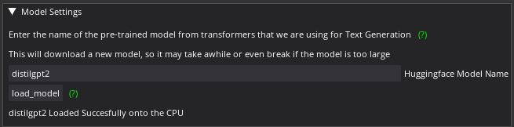
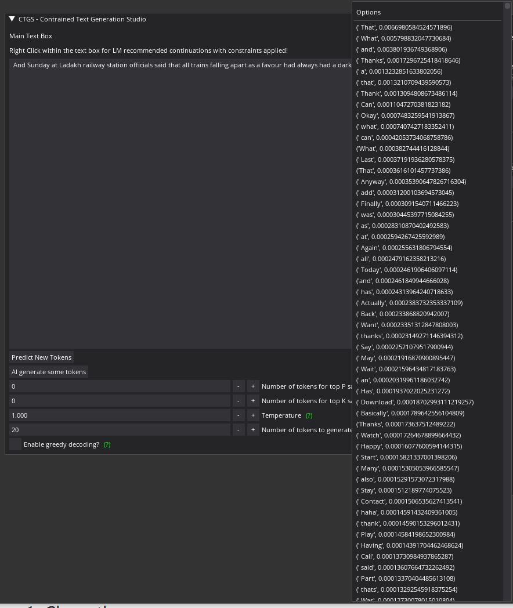
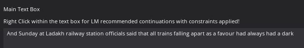
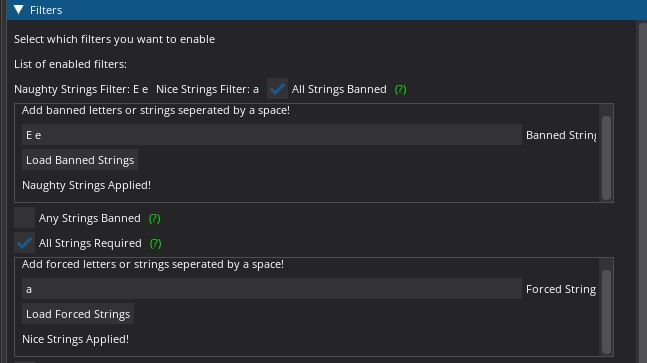
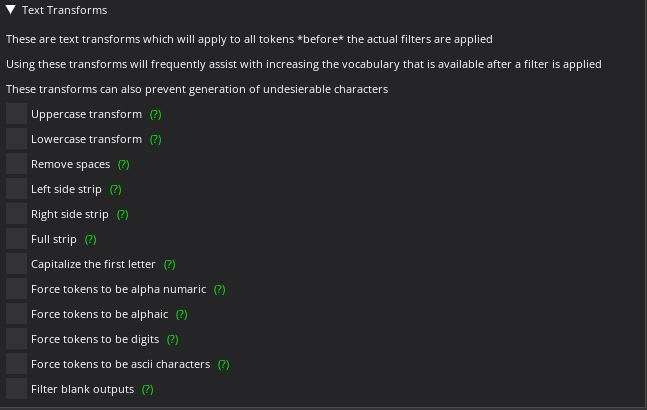

# Constrained-Text-Generation-Studio
### _"It's Like Photoshop but for Creative Writing!"_

# Table of Contents  
* [Introduction](#introduction)
* [Features](#features)
* [Install Instructions](#install-instructions)
* [Usage Instructions](#usage-instructions)

# Introduction
**"Constrained Text Generation Studio"** (CTGS) is an AI writing assistant for recreational linguists, poets, creative writers, and/or researchers to use and study the ability of **large-scale language models to generate constrained text.**

CTGS allows users to generate or choose from text with any combination of a wide variety of constraints, such as banning a particular letter, forcing the generated words to have a certain number of syllables, and/or forcing the words to be partial anagrams of another word. A partial list of these sorts of constraints can be found [here](https://en.wikipedia.org/wiki/Constrained_writing#Description)

CTGS uses an extremely simple and intuitive algorithm. At each generation, a language model is actually sampling from a probability distribution of its entire vocabulary (which is usually tokenized sub-words). **Why don't we just ban the tokens within the vocabulary which violate the chosen constraints before the sampling step?**. This has two advantages over fine-tuning. The first advantage is that the model will never violate the imposed constraint, which is unfortunately impossible to guarantee for a fine-tuned model alone. The second advantage is that on constrained writing datasets, this technique results in strictly superior preplexity over fine-tuning alone (which makes sense because we are literally banning errrors). 

CTGS, along with the related contributions of its [datasets](https://huggingface.co/datasets/Hellisotherpeople/Lipogram-e), and a huggingface "space" webapp called [Gadsby](https://huggingface.co/spaces/Hellisotherpeople/Gadsby), are all presented as part of our paper titled ["Most Language Models can be Poets too: An AI Writing Assistant and Constrained Text Generation Studio"](https://drive.google.com/file/d/1lTZX5_Ef0nsOXj7s1x_S7LPdgYvzcp-g/view) to appear at [The Second Workshop on When Creative AI Meets Conversational AI (CAI2)](https://sites.google.com/view/cai-workshop-2022), jointly held at [The 29th International Conference on Computational Linguistics (COLING 2022)](https://coling2022.org/)

# Features

CTGS consists of 3 main components, the model, the filters, and the text transformations. 

### HF Integration

CTGS supports any casual language model available on [Huggingface](https://huggingface.co/models?pipeline_tag=text-generation&sort=downloads). Future updates will add support for Masked Language Models, and for text-to-text models (which are supported at this time by [Gadsby](https://huggingface.co/spaces/Hellisotherpeople/Gadsby).

### Filters 

CTGS has 21 filters at this time. These filters are applied to all tokens in the LM vocabulary after any text-transforms have been applied. Any combination of these filters can be applied, as they are naturally composable. 

The filters are as follows: 

* **Lipograms** labeled as "All Strings Banned" - A lipogram is when a particular letter or group of strings is avoided.
* **Weak Lipograms** labeled as "Any Strings Banned" - A weak lipogram is when at least one of a particular letter or group of strings is avoided.
* **Reverse Lipograms** labeled as "All Strings Required" - A reverse lipogram is when a particular letter or group of strings is forced.
* **Weak Reverse Lipograms** labeled as "Any Strings Required" - A weak reverse lipogram is when at least one of a particular letter or group of strings is forced.
* **String In Position** - This allows one to force a particular letter in a particular position of a string. Works best with white space stripping.
* **String Starts With** - This allows one to guarantee that the string will start with a particular set of letters.
* **String Ends With** - This allows one to guarantee that the string will end with a particular set of letters.
* **String Edit Distance Matching** - This uses Levenshtein distance to return all strings with lower edit distance to a given string then specified.
* **String Length Equal To** - This allows one to guarantee that the string will be of a particular length. Works best with white space stripping.
* **String Length Greater Than** - This allows one to guarantee that the string will be longar than a particular length.
* **String Length Lesser Than** - This allows one to guarantee that the string will be shorter than particular length.
* **Phonetic Matching** - This uses the double-metaphone algorithm to phonetically match your string with the passed in string.
* **Semantic Matching** - This uses fasttext word vectors to return strings which are semantically similar to the provided string.
* **Syllable Count** - This will return strings with the specified number of syllables.
* **Meter** - This will return strings with the matching stress pattern of a passed in string, also called meter.
* **Rhyme** - This will return strings that rhyme with the provided string.
* **Palindrome** - A palindrome is a string which reads the same backward as forward, such as madam or racecar
* **Anagram** - An anagram is a string formed by rearranging the letters of a different string.
* **Partial Anagram** - A partial anagram is a string constructed by rearranging some or all of the letters of a different string.
* **Isogram** - An isogram is a string in which none of its characters appear more than the provided number of times
* **Reverse Isogram** - A reverse isogram is a string in which all of its characters appear more than the provided number of times

### Text Transforms

Not all language models have the same kinds of vocabulary. Most vocabularies include a wide variety of sub-words, full-words, punctuation, spaces and misc combinations of the previously mentioned. Many of the filters are more effective when text normalization processes are ran. To that end, we also make textual transforms which operate before the filtering process available. There are 12 of them, and they are as follows: 

* **Uppercase transform** - Use this to cause all text to be UPPERCASED LIKE THIS
* **Lowercase transform** - Use this to force all tokens to be lowercased like this
* **Remove spaces** - Use this to force all tokens to not have spaces likethis
* **Left side strip** - Use this to stip spaces from the left of the text
* **Right side strip** - Use this to stip spaces from the right of the text
* **Full strip** - Use this to stip spaces from both sides of the text
* **Capitalize the first letter** - Use this to force all tokens to have their first letter capitalized Like This
* **Force tokens to be alpha numaric** - Use this to force all tokens to be alphanumaric, meaning only using the alphabet or numbers
* **Force tokens to be alphaic** - Use this to force all tokens to be alphaic, meaning only using the alphabet
* **Force tokens to be digits** - Use this to force all tokens to be digits, meaning only using numbers
* **Force tokens to be ascii characters** - Use this to force all tokens to be ascii characters - to filter out unicode
* **Filter blank outputs** - After applying some other transforms, there may be leftover blanks. This will remove them

# Install Instructions

1.  Clone the repo
2.  cd into the repo directory (you may get font errors if you don't cd into it) 
3. `pip install -r requirements.txt`
4. `python3 Constrained-Text-Generation-Studio.py`

# Usage Instructions

The first time you run this, it may take a few minutes to be ready to run because distilgpt2 and fasttext are being downloaded from huggingface. Wait until you see a messege in the Model Settings window about it being succesfully loaded before trying to run CTGS

Right click anywhere within the text box for a list of continuations with the enabled filters to appear. Here the letter "e" is banned and the letter "a" is forced to appear

The F1 key generates new tokens given the context and filters (populates the right click continuations box), and is equivilant to the Predict New Tokens button

The F2 key directly inserts the next token into the text box using the models decoder (and top_p, top_k, temperature) settings. It's equivilant to the AI generate some tokens button. We can see an example of doing this with the default settings, with the letter "e" banned and the letter "a" is forced to appear:

If you're not seeing continuations using F2 or the AI generate some token button, make sure that it's not generating spaces, line returns, or other blank characters

You can enable and see which filters are enabled with the Filters window. In this example, we have banned the letter "e", and forced the letter "a" to appear. 

Use the text transforms list to apply transforms to the vocabulary before the constraints are applied. To mitigate the problem of the LM generating spaces, you could for example use the filter blank outputs transform

After typing or copying/pasting text into the text box, use the Predict New Tokens button or F1 to get new continuations (what you see when you right click) given your context.

This utility is written using the DearPyGUI GUI library, and has the tiling mode enabled. You can move around the windows and tile them with each other to your hearts desire. I think a tool like this is a natural fit for a tiling window manager style layout

Hovering over a green question-mark will pop-up a tooltip to give you context/help

# Screenshots
