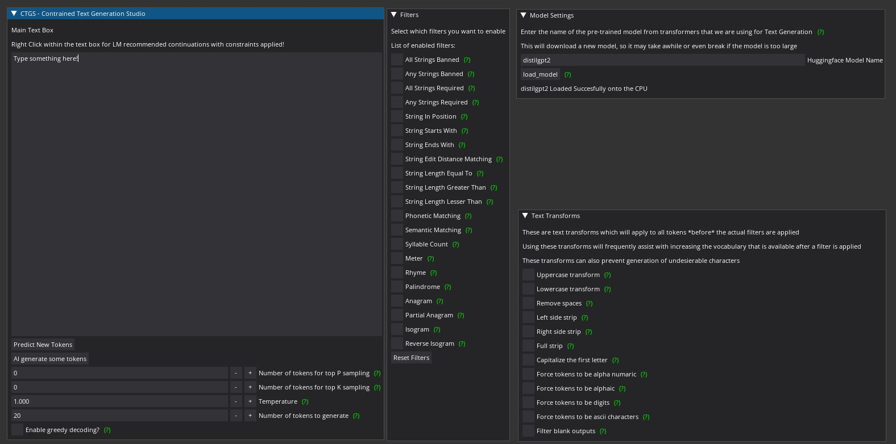

# Constrained-Text-Generation-Studio
### _"It's Like Photoshop but for Creative Writing!"_

# Table of Contents  
* [Introduction](#introduction)
* [Features](#features)
* [Install Instructions](#install-instructions)
* [Usage Instructions](#usage-instructions)
* [Examples](#examples)  
* [Future Plans](#what-are-your-plans)

# Introduction
**"Constrained Text Generation Studio"** (CTGS) is an AI writing assistant for recreational linguists, poets, creative writers, and/or researchers to use and study the ability of **large-scale language models to generate constrained text.**

CTGS allows users to generate or choose from text with any combination of a wide variety of constraints, such as banning a particular letter, forcing the generated words to have a certain number of syllables, and/or forcing the words to be partial anagrams of another word. A partial list of these sorts of constraints can be found [here](https://en.wikipedia.org/wiki/Constrained_writing#Description)

CTGS uses an extremely simple and intuitive algorithm. At each generation, a language model is actually sampling from a probability distribution of its entire vocabulary (which is usually tokenized sub-words). **Why don't we just ban the tokens within the vocabulary which violate the chosen constraints before the sampling step?**. This has two advantages over fine-tuning. The first advantage is that the model will never violate the imposed constraint, which is unfortunately impossible to guarantee for a fine-tuned model alone. The second advantage is that on constrained writing datasets, this technique results in strictly superior preplexity over fine-tuning alone (which makes sense because we are literally banning errrors). 

CTGS, along with the related contributions of its [datasets](https://huggingface.co/datasets/Hellisotherpeople/Lipogram-e), and a huggingface "space" webapp called [Gadsby](https://huggingface.co/spaces/Hellisotherpeople/Gadsby), are all presented as part of our paper titled ["Most Language Models can be Poets too: An AI Writing Assistant and Constrained Text Generation Studio"](https://drive.google.com/file/d/1lTZX5_Ef0nsOXj7s1x_S7LPdgYvzcp-g/view) to appear at [The Second Workshop on When Creative AI Meets Conversational AI (CAI2)](https://sites.google.com/view/cai-workshop-2022), jointly held at [The 29th International Conference on Computational Linguistics (COLING 2022)](https://coling2022.org/)

# Install Instructions

1.  Clone the repo
2.  cd into the repo directory (you may get font errors if you don't cd into it) 
3. `pip install -r requirements.txt`
4. `python3 Constrained-Text-Generation-Studio.py`

# Screenshots
